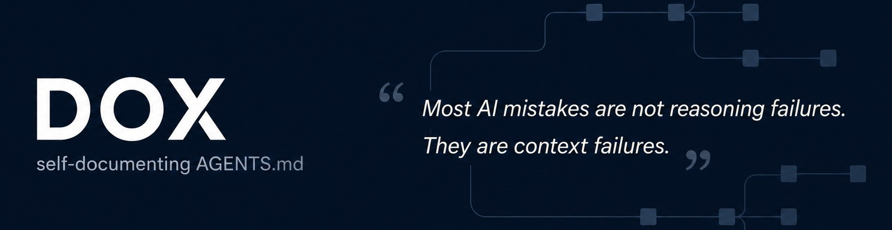

<p align="center">
  
</p>

## How DOX works

DOX is a tiny AGENTS.md framework that gives an AI agent precise project context.

The agent keeps a hierarchy of AGENTS.md files as the project changes:

- root AGENTS.md contains project-wide instructions and the top-level index
- child AGENTS.md files contain local instructions for specific areas
- before any edit, the agent walks the docs tree from the root to the area it will touch
- the relevant docs give it exact local guidelines, so it does not edit blindly
- after meaningful changes, it updates the affected AGENTS.md files

The result is simple: traverse the docs, understand the local rules, make precise edits, keep the docs current. Less guessing. Less drift. Less "why did it touch that file?"

## How to use

1. Copy the contents of [AGENTS.md](./AGENTS.md?plain=1) into your project's AGENTS.md file.

<br>
That's it. No installation, no dependencies, no package, no runtime. DOX is just a Markdown instruction for AI agents.

It works with any AI agent that supports AGENTS.md files, including Codex, Claude Code, OpenCode, and similar tools.

No AGENTS.md yet? Copy the file into your project root. The agent will see these instructions and will start building the DOX tree.

For an existing project, you can tell your agent: `Initialize DOX tree for this project now.` It will create all the child AGENTS.md files and indexes.

## Usage examples

### Basic setup

1. Create or open a project repository.
2. Copy [AGENTS.md](./AGENTS.md?plain=1) to the project root.
3. Ask your coding agent: `Initialize DOX tree for this project now.`
4. Review the generated child indexes before accepting the changes.

### After changing code

1. The agent reads the root `AGENTS.md` and every applicable child `AGENTS.md` before editing.
2. The agent makes the requested code or documentation change.
3. The agent performs a DOX pass before closeout.
4. If the change affects durable structure, ownership, contracts, workflows, verification, or child indexes, the nearest owning `AGENTS.md` is updated.
5. If the change is local and does not affect durable rules, the agent reports that docs were intentionally left unchanged.

### Optional validation

DOX is Markdown-first, but this fork includes an optional convention and linter:

```bash
python3 scripts/dox_lint.py .
```

The linter checks that child indexes point to real `AGENTS.md` files, child docs keep the standard section shape, and the protected root DOX framework block is present. This fork also includes a GitHub Actions workflow that runs the same check on pushes to `main` and pull requests.

## Optional agent templates

See [agents/](./agents/) for portable orchestrator and documenter templates. They describe a two-agent maintenance pattern:

- an orchestrator scans the repository and assigns candidate paths
- documenter agents inspect one path at a time and update the nearest owning `AGENTS.md` when DOX requires it

The templates are examples, not a required runtime. Adapt their tool names to your agent harness.

## Specification and evidence

- [docs/spec.md](./docs/spec.md) defines the optional machine-checkable DOX convention.
- [docs/evidence.md](./docs/evidence.md) records reported third-party session metrics and the caveats around interpreting them.

## Credits

<p align="center">
  Created by <strong><a href="https://www.agent-zero.ai/">Agent Zero</a></strong><br>
  Open-source agentic AI framework<br>
  <a href="https://www.agent-zero.ai/">Website</a> · <a href="https://github.com/agent0ai/agent-zero">GitHub repository</a>
</p>
